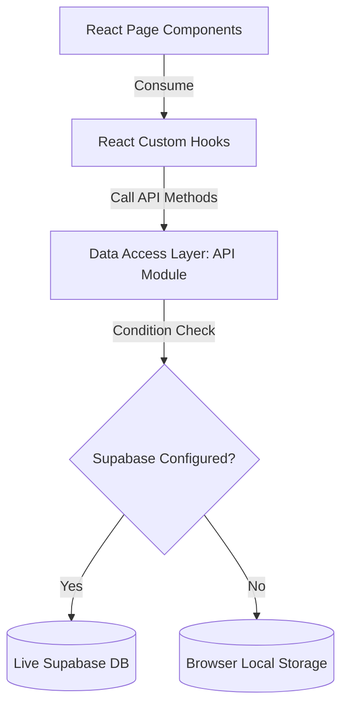

# System Architecture Document — SecureSwap

This document details the software architecture, folder organization, data flow protocols, and modular concerns of SecureSwap.

---

## 1. Directory Structure

The codebase is organized following a clean, modular page-driven layout:

```text
src/
├── api/                    # Data Access Layer (DAL)
│   ├── exchangeApi.js      # Exchange operations (Supabase + localStorage)
│   └── userApi.js          # Profile/user queries
├── components/             # Reusable UI component layer
│   ├── ui/                 # Basic UI elements (Button, Input, Checkbox, Select)
│   ├── AppIcon.jsx         # Tree-shaking-ready dynamic icon renderer
│   ├── AppImage.jsx        # Image element loader with fallback SVGs
│   └── ProtectedRoute.jsx  # Client-side router route security guard
├── contexts/               # React Global Context Providers
│   ├── CurrencyContext.jsx # Currency conversion and display rates
│   └── ThemeContext.jsx    # Dark/Light mode choice hook
├── hooks/                  # React custom hook abstractions
│   ├── useAuth.js          # Authentication hooks and OAuth syncing
│   ├── useExchanges.js     # Live CRUD exchanges syncing
│   └── useMatching.js      # Match calculations and profiles
├── pages/                  # Page Containers
│   ├── create-exchange/    # Form components for posting listings
│   ├── exchange-dashboard/ # Active listings listing and stats overview
│   ├── exchange-details/   # Room negotiation screen and real-time chat
│   └── exchange-matching/  # Match filters and partner review cards
└── utils/                  # Client utilities
    ├── cn.js               # CSS class merger utility
    ├── session.js          # Client token and session accessors
    └── supabaseClient.js   # Supabase client credentials initialization
```

---

## 2. Core Architectural Layers

### 2.1. Presentational Components (Pages & Views)
Pages in `src/pages/` are presentational containers. They do not handle SQL or raw file persistence. They consume business logic exposed by hooks and render clean components.

### 2.2. React Custom Hooks (Business Logic)
Hooks in `src/hooks/` abstract page states. For instance, `useExchanges` maintains the loading state, handles errors, and updates the local state array.

### 2.3. Data Access Layer (API modules)
API modules in `src/api/` represent network actions. They check if Supabase endpoints are accessible. If yes, they communicate using the Supabase client. If no variables exist, they automatically redirect read/write calls to the browser's `localStorage` to keep the user flow operational.

---

## 3. Data Flow Diagram


