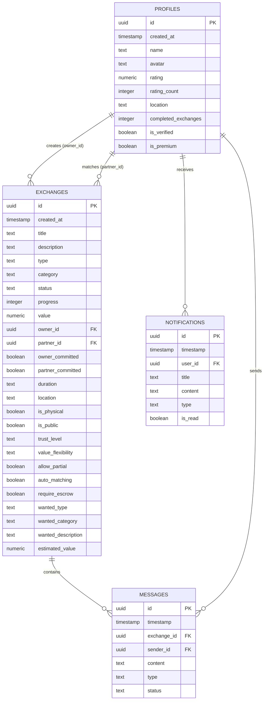

# Database Schema & RLS Policies — SecureSwap

This document details the database schemas, tables, relationships, and security (RLS) policies configured in the Supabase database.

---

## 1. Schema Diagram & Relationships



---

## 2. Row-Level Security (RLS) Policies

All tables reside in the exposed `public` schema. To secure user records, Row-Level Security (RLS) is enabled for all tables with the following rules:

### 2.1. `profiles` Table
* **Select**: Allow public reads (`TO anon, authenticated`) so users can search and view potential exchange partners.
* **Insert/Update/Delete**: Restrict changes to the matching user ID:
  ```sql
  CREATE POLICY "Allow profile owner updates" ON public.profiles
  FOR UPDATE TO authenticated
  USING (auth.uid() = id)
  WITH CHECK (auth.uid() = id);
  ```

### 2.2. `exchanges` Table
* **Select**: Allow public reads for public listings (`is_public = true`) and private reads for members:
  ```sql
  CREATE POLICY "Allow members access to exchanges" ON public.exchanges
  FOR SELECT TO authenticated
  USING (is_public = true OR auth.uid() = owner_id OR auth.uid() = partner_id);
  ```
* **Insert**: Allow authenticated users to create listings (`auth.uid() = owner_id`).
* **Update/Delete**: Restrict edits to the owner or assigned partner.

### 2.3. `messages` Table
* **Select**: Only allow members of the corresponding exchange room to read logs:
  ```sql
  CREATE POLICY "Allow members select messages" ON public.messages
  FOR SELECT TO authenticated
  USING (
    EXISTS (
      SELECT 1 FROM public.exchanges
      WHERE exchanges.id = messages.exchange_id
      AND (exchanges.owner_id = auth.uid() OR exchanges.partner_id = auth.uid())
    )
  );
  ```
* **Insert**: Allow authenticated users to insert new messages if they belong to that exchange.
