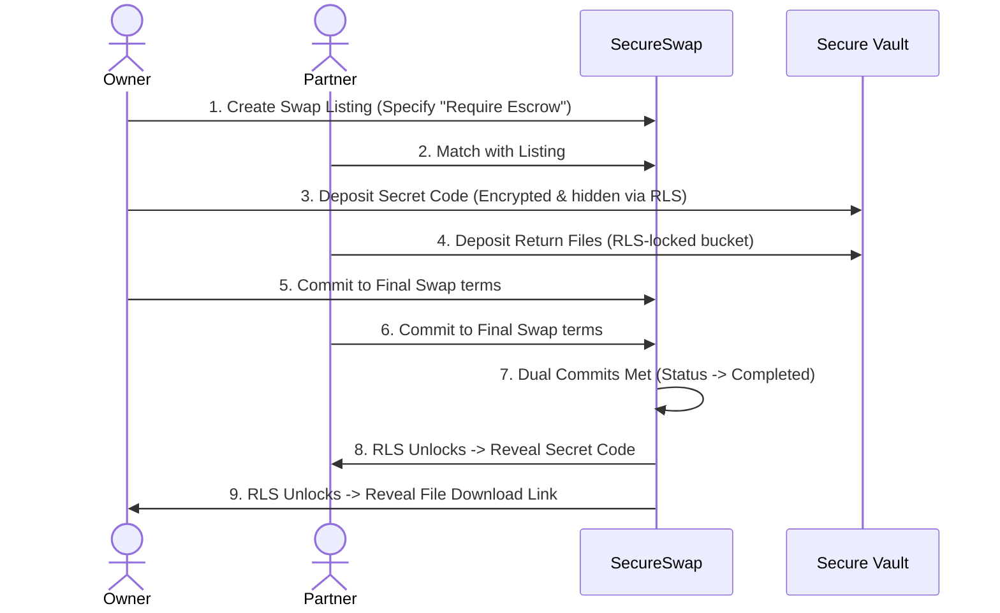

# Escrow System Architecture Plan — SecureSwap

This document details the system design, commodity vault requirements, PostgreSQL schema triggers, and moderator panels proposed to implement a secure Escrow system in SecureSwap.

---

## 1. Analysis of Swap Commodity Categories

Different items traded on SecureSwap dictate different escrow mechanisms. We group them below to define which require database-level locking versus financial middlemen:

### 1.1. Digital Secrets (Category A)
* **Examples**: Gift cards, Steam keys, software licenses, database secrets.
* **Escrow Mechanic**: **Database Encrypted Vault** (using Postgres Row-Level Security).
* **Middleman Account?**: **No**. The system holds the encrypted key in the database and only decrypts/exposes it when both parties commit.
* **Verification Challenge**: The database cannot check if a gift card is spent. Reputation score collateral and a dispute system are required to prevent fraudulent claims.

### 1.2. Digital Deliverables (Category B)
* **Examples**: Logo files, PDF contracts, source code ZIP files.
* **Escrow Mechanic**: **Supabase Private Storage Bucket**.
* **Middleman Account?**: **No**. The creator uploads files to a private storage bucket. The platform's RLS rules prevent the partner from downloading it until both parties have matched and locked terms.
* **Verification Challenge**: Automatically verifiable (the system checks if a file exists in the bucket before prompting the user to commit).

### 1.3. Physical Items (Category C)
* **Examples**: Tech hardware, sneakers, clothing, physical items.
* **Escrow Mechanic**: **Shipping API (Shippo/EasyPost) + Security Collateral Holds**.
* **Middleman Account?**: **Optional**. For simple swaps, a database lock releases upon carrier shipment tracking confirmation. To secure high-value items, a credit/fiat hold is recommended.

### 1.4. Hybrid Money Swaps (Category D)
* **Examples**: Logo design in exchange for $150.
* **Escrow Mechanic**: **Stripe Connect Express / Escrow Wallet**.
* **Middleman Account?**: **Yes**. A payment provider holds the cash in transit and transfers it only when both parties commit.

---

## 2. Proposed Database Schema Addition (Supabase SQL)

To support Category A (digital secrets) swaps, we propose adding the `public.escrow_vault` table to secure keys in transit:

```sql
-- Vault to secure digital keys and codes
CREATE TABLE IF NOT EXISTS public.escrow_vault (
    id UUID PRIMARY KEY DEFAULT gen_random_uuid(),
    exchange_id UUID NOT NULL REFERENCES public.exchanges(id) ON DELETE CASCADE,
    depositor_id UUID NOT NULL REFERENCES auth.users(id) ON DELETE CASCADE,
    secret_code TEXT NOT NULL, -- Encrypted code string
    created_at TIMESTAMP WITH TIME ZONE DEFAULT timezone('utc'::text, now()) NOT NULL
);

-- Enable RLS
ALTER TABLE public.escrow_vault ENABLE ROW LEVEL SECURITY;

-- Select policy: Only allow reads when both parties have committed
CREATE POLICY "Expose vault secret only when both parties commit" ON public.escrow_vault
    FOR SELECT TO authenticated
    USING (
        EXISTS (
            SELECT 1 FROM public.exchanges 
            WHERE exchanges.id = escrow_vault.exchange_id 
              AND exchanges.status = 'completed'
              AND (exchanges.creator_id = auth.uid() OR exchanges.partner_id = auth.uid())
        )
    );

-- Insert policy: Users can insert their own secrets
CREATE POLICY "Users can deposit secrets for active exchanges" ON public.escrow_vault
    FOR INSERT TO authenticated
    WITH CHECK (
        auth.uid() = depositor_id AND
        EXISTS (
            SELECT 1 FROM public.exchanges 
            WHERE exchanges.id = escrow_vault.exchange_id 
              AND (exchanges.creator_id = auth.uid() OR exchanges.partner_id = auth.uid())
        )
    );
```

---

## 3. The Escrow User Journey



---

## 4. Admin Portal & Dispute Arbitration

Because digital codes cannot be automatically validated, we plan to implement a dispute resolver:
1. **Disputed State**: If a user reports a bad trade, the exchange transitions to a `disputed` status.
2. **Moderator Policy**: RLS rules grant read access to a designated `moderator` role.
3. **Admin Dashboard**: Enables system admins to view the chat history, vault contents, and file logs to award or refund the escrow manually.
