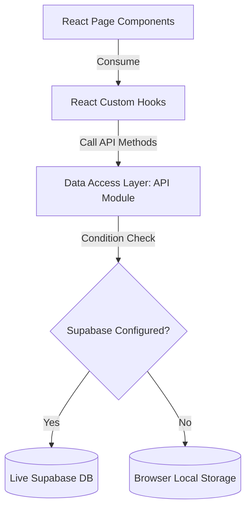

# SecureSwap — Trustless Peer-to-Peer Exchange Platform

SecureSwap is a modern, trustless peer-to-peer (P2P) exchange web application built to enable users to barter digital services, gift cards, and physical items safely. Designed with a premium, motion-rich UX (using Outfit/Inter fonts, desaturated accents, and glassmorphism styling) and backed by a robust database layer, it provides a seamless command-center dashboard for managing negotiations.

The application features a hybrid data model: it runs fully connected to a live Supabase PostgreSQL backend when configured, and automatically falls back to browser-level localStorage when environment variables are omitted, ensuring a fully operational demo flow under any conditions.

---

## 🏗️ Architectural Overview & Data Flow

SecureSwap operates on a modular page-driven layout that isolates presentation layers from business logic and data access rules:



### Key Highlights:
* **Asymmetric Bento Grid Dashboard**: Renders platform metrics and active contracts in a visual 12-column layout.
* **Split-Panel Sliding Workspace**: Transition details and messaging side-by-side without context switching.
* **Live Supabase Data Sync**: Real-time message streaming powered by PostgreSQL row triggers.
* **Security-First Architecture**: Strictly enforced database Row-Level Security (RLS) and JWT route protection.

---

## 🚀 Key Features

* **Dual-Mode Data Sync**: Fully integrated live Supabase DB with automated dynamic fallback to browser `localStorage` when credentials are unset.
* **Real-time Chat & Negotiations**: Subscribes to Supabase real-time channels to deliver instant negotiation messages.
* **Premium Theme Styling**: Sleek glassmorphic design token system supporting smooth transitions between Light and Dark modes.
* **Google OAuth & JWT Authentication**: Complete token-based user sign-up, login, and Google Sign-In authentication.
* **Protected Session Redirections**: Multiple route guards separating public views from private transaction spaces.
* **Vite Manual Chunking & Lazy Routes**: Lightweight bundles for maximum loading performance.

---

## 🛠️ Tech Stack

* **Frontend Framework**: React 18 (Vite-powered SPA)
* **Styling & Theme**: Tailwind CSS 3.x, PostCSS, and Framer Motion
* **Database & Auth**: Supabase (PostgreSQL 15+, RLS Policies, Database Triggers)
* **State Management**: Redux Toolkit & React Custom Contexts (Theme, Currency, Notifications)
* **Client Routing**: React Router DOM v6
* **Icons & Assets**: Lucide React, Unsplash curated images

---

## 📋 Prerequisites

Before running the application, ensure you have:
* **Node.js** (v18.0.0 or higher)
* **npm** (v9.0.0 or higher)

---

## 🚀 Getting Started

### 1. Clone the Repository
```bash
git clone https://github.com/Krish8732/secureswap.git
cd secureswap
```

### 2. Install Dependencies
```bash
npm install
```

### 3. Environment Setup
Create a `.env` file in the root directory to configure the live Supabase credentials. If skipped, SecureSwap automatically launches in **Local Demo Mode** using browser storage.

```text
VITE_SUPABASE_URL=https://your-project-id.supabase.co
VITE_SUPABASE_ANON_KEY=your-public-anon-key
```

### 4. Start Development Server
```bash
npm run start
```
Open [http://localhost:4028](http://localhost:4028) in your browser to view the application.

### 5. Verify Build Compilation
Verify the production bundles compile cleanly:
```bash
npm run build
```

---

## 📂 Documentation Suite

SecureSwap includes a comprehensive, modular documentation suite mapping out every technical concern:

* 📄 [PRD.md](file:///c:/Users/krish/Desktop/projects/secureswap/PRD.md): Product requirements, features, and future scope.
* 📄 [ARCHITECTURE.md](file:///c:/Users/krish/Desktop/projects/secureswap/ARCHITECTURE.md): Directories structure, React hooks logic, and DAL maps.
* 📄 [DATABASE_SCHEMA.md](file:///c:/Users/krish/Desktop/projects/secureswap/DATABASE_SCHEMA.md): Database table models, relationships, and RLS rules.
* 📄 [DESIGN_SYSTEM.md](file:///c:/Users/krish/Desktop/projects/secureswap/DESIGN_SYSTEM.md): Light/Dark themes, CSS design tokens, and components styles.
* 📄 [SECURITY.md](file:///c:/Users/krish/Desktop/projects/secureswap/SECURITY.md): Client-side hardening, Protected Route guards, and OAuth details.
* 📄 [API_DOCUMENTATION.md](file:///c:/Users/krish/Desktop/projects/secureswap/API_DOCUMENTATION.md): Endpoint payloads, query structures, and realtime Postgres channels.
* 📄 [STAGING_AND_TESTING.md](file:///c:/Users/krish/Desktop/projects/secureswap/STAGING_AND_TESTING.md): **[NEW]** Staging deployment setup, Vercel instructions, CI/CD Actions, and Vitest hook tests.
* 📄 [NOTIFICATIONS_SYSTEM.md](file:///c:/Users/krish/Desktop/projects/secureswap/NOTIFICATIONS_SYSTEM.md): **[NEW]** SQL schema triggers, push-alert logic, and React Context real-time integration.

---

## 🧪 Testing Strategy

Our testing strategy focuses on unit-testing core React custom hooks (`useAuth`, `useExchanges`) and verifying page layouts in simulated environments:
* **Unit testing runner**: Vitest
* **Dom assertion tool**: React Testing Library
* **CI verification**: Automatic build and linting checks run on every pull request to `main`.
* *For setup and test specifications, refer to [STAGING_AND_TESTING.md](file:///c:/Users/krish/Desktop/projects/secureswap/STAGING_AND_TESTING.md).*

---

## 🌐 Staging & Deployment

* **Host**: Vercel
* **Pipeline**: Automatic deployment via GitHub Actions triggers when code is pushed to the `main` branch.
* *For Vercel settings and environment configuration details, check [STAGING_AND_TESTING.md](file:///c:/Users/krish/Desktop/projects/secureswap/STAGING_AND_TESTING.md).*

---

## 🛠️ Troubleshooting

### Supabase Connection issues
* **Issue**: The application works but doesn't persist data across devices.
* **Resolution**: Ensure `.env` is present in the root folder, and keys do not contain placeholder dummy strings. Restart the Vite development server after editing `.env`.

### Vite Build Errors
* **Issue**: Code compiles locally but fails in production build scripts.
* **Resolution**: Run `npm run build` locally to print detail errors. Clean the cache by deleting `node_modules` and running `npm install`.

### Dynamic Route Reload 404
* **Issue**: Reloading on pages like `/exchange-dashboard` triggers a Vercel 404.
* **Resolution**: Verify `vercel.json` exists in the project root with the correct rewrites rule to delegate all routes to `/index.html`.
