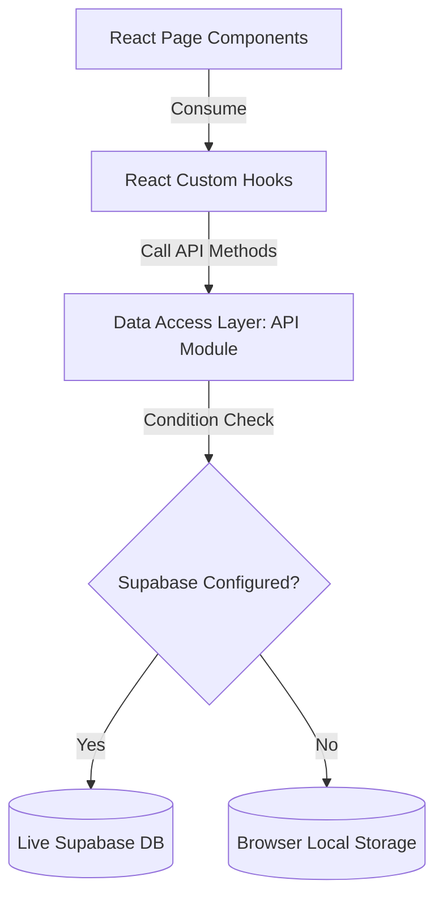

# SecureSwap — Trustless Peer-to-Peer Exchange Platform

SecureSwap is a modern, trustless peer-to-peer (P2P) exchange web application built to enable users to barter digital services, gift cards, and physical items safely. Designed with an premium, motion-rich UX and backed by a robust database layer, it provides a seamless command-center dashboard for managing negotiations.

---

## 🏗️ Architectural Overview & Data Flow

SecureSwap operates on a modular page-driven layout that isolates presentation layers from business logic and data access rules:



### Key Highlights:
- **Asymmetric Bento Grid Dashboard**: Renders platform metrics and active contracts in a visual 12-column layout.
- **Split-Panel Sliding Workspace**: Transition details and messaging side-by-side without context switching.
- **Live Supabase Data Sync**: Real-time message streaming powered by PostgreSQL row triggers.
- **Security-First Architecture**: Strictly enforced database Row-Level Security (RLS) and JWT route protection.

---

## 🚀 Features

* **Live Supabase DB Layer**: Fully connected data layer with dynamic fallback to browser `localStorage` if database variables are unset.
* **Real-time Chat Negotiations**: Subscribes to Supabase realtime channels to deliver instant negotiation messages.
* **Premium Theme Styling**: Sleek glassmorphism look with responsive Light and Dark themes.
* **Google OAuth Authentication**: Fully supports Google Sign-In with automated local token syncing.
* **Protected Session Redirections**: Multi-step Route Guards protecting all private pages.
* **Vite manual chunking & lazy routes**: Lightweight bundles for maximum loading performance.

---

## 📋 Prerequisites

* Node.js (v18.x or higher)
* npm

---

## 🛠️ Installation & Setup

1. **Install dependencies**:
   ```bash
   npm install
   ```

2. **Configure Environment Variables**:
   Create a `.env` file in the root folder and configure your Supabase variables:
   ```text
   VITE_SUPABASE_URL=https://your-project-id.supabase.co
   VITE_SUPABASE_ANON_KEY=your-public-anon-key
   ```

3. **Start the development server**:
   Since the configuration scripts use Vite, run:
   ```bash
   npm run start
   ```

4. **Verify build compilation**:
   ```bash
   npm run build
   ```

---

## 📂 Documentation Suite

* [PRD.md](file:///c:/Users/krish/Desktop/projects/secureswap/PRD.md): Product requirements, features, and future scope.
* [ARCHITECTURE.md](file:///c:/Users/krish/Desktop/projects/secureswap/ARCHITECTURE.md): Directories structure, React hooks logic, and DAL maps.
* [DATABASE_SCHEMA.md](file:///c:/Users/krish/Desktop/projects/secureswap/DATABASE_SCHEMA.md): Database table models, relationships, and RLS rules.
* [DESIGN_SYSTEM.md](file:///c:/Users/krish/Desktop/projects/secureswap/DESIGN_SYSTEM.md): Light/Dark themes, CSS design tokens, and components styles.
* [SECURITY.md](file:///c:/Users/krish/Desktop/projects/secureswap/SECURITY.md): Client-side hardening, Protected Route guards, and OAuth details.
* [API_DOCUMENTATION.md](file:///c:/Users/krish/Desktop/projects/secureswap/API_DOCUMENTATION.md): Endpoint payloads, query structures, and realtime Postgres channels.
