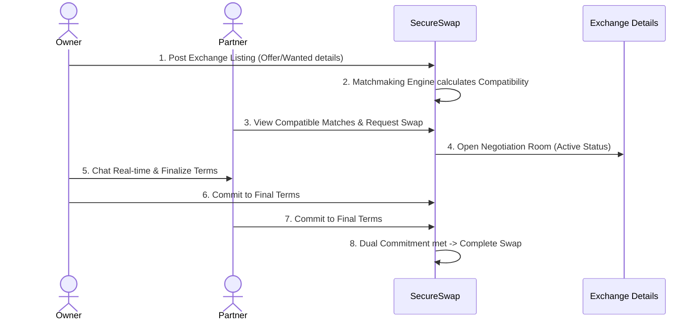

# SecureSwap — Trustless Peer-to-Peer Exchange Platform

SecureSwap is a modern, trustless peer-to-peer (P2P) exchange web application built to enable freelancers, traders, and creators to barter digital services, gift cards, and physical items safely. Designed with a premium, motion-rich UX and backed by a robust database layer, it provides a seamless command-center dashboard for managing negotiations.

---

## 💡 The Problem & The Solution

### The Problem
Traditional online bartering is plagued by three major roadblocks:
1. **The Trust Deficit**: In P2P trades, who goes first? If a designer sends a logo first, there is no guarantee they will receive the agreed-upon return service. This fear of exit-scams stifles direct peer exchange.
2. **Double Coincidence of Wants**: Finding a partner who not only wants what you offer, but also has exactly what you are seeking, is incredibly difficult.
3. **Scattershot Negotiation**: Swaps are usually negotiated via unorganized Discord, Telegram, or email chats, leading to misaligned expectations, shifting terms, and payment disputes.

### SecureSwap's Solution
SecureSwap eliminates these friction points by providing a structured, secure P2P trading portal:
* **Double-Commitment Protocol**: Both parties must explicitly review and "Lock Terms" and "Commit" to the finalized exchange details before a swap is marked complete, ensuring mutual accountability.
* **Reputation & Verification Metrics**: User profiles feature rating scores, success rates, and verified badges computed from successful historical swaps.
* **Matchmaking Engine**: Scans listings, matches offering and wanted categories, calculates compatibility scores, and suggests partners.
* **Structured Room Negotiations**: Integrates chat and terms specifications side-by-side, maintaining a persistent, real-time single source of truth.

---

## 🔄 The User Workflow



---

## 📂 Project Directory Structure

The codebase is organized following a clean, modular page-driven layout that isolates presentation layers from business logic and data access rules:

```text
src/
├── api/                    # Data Access Layer (DAL)
│   ├── exchangeApi.js      # Exchange queries (Supabase with localStorage fallback)
│   └── userApi.js          # Profile/user queries
├── components/             # Reusable Presentation Layer
│   ├── ui/                 # Atomic UI elements (Button, Input, Checkbox, Select)
│   ├── AppIcon.jsx         # Tree-shaking-ready dynamic icon renderer
│   ├── AppImage.jsx        # Image element loader with fallback SVGs
│   └── ProtectedRoute.jsx  # Client-side router route security guard
├── contexts/               # React Global Context Providers
│   ├── CurrencyContext.jsx # Currency conversion and display rates
│   └── ThemeContext.jsx    # Dark/Light mode choice hook
├── hooks/                  # Custom React Hooks (Business Logic Layer)
│   ├── useAuth.js          # Session state and login/signup mechanics
│   ├── useExchanges.js     # Live CRUD exchanges sync state
│   └── useMatching.js      # Match calculations and profile scoring
├── pages/                  # Page Containers (Views)
│   ├── create-exchange/    # Form components for posting listings
│   ├── exchange-dashboard/ # Active listings and stats overview
│   ├── exchange-details/   # Negotiation room workspace and real-time chat
│   └── exchange-matching/  # Match filters and partner review cards
└── utils/                  # Core client utilities
    ├── cn.js               # CSS class merger utility
    ├── session.js          # Client token and session accessors
    └── supabaseClient.js   # Supabase client credentials initialization
```

### Why It's Structured This Way:
* **Strict Separation of Concerns**: Pages (views) only concern themselves with layout and rendering. The business logic lives in Custom Hooks, and API communication resides in the Data Access Layer (DAL).
* **Robust Offline/Mock Fallback**: The API modules automatically check if Supabase keys are active. If not, they redirect all fetch, write, and session requests to the browser's `localStorage`. This allows the entire app to remain fully functional for local demonstrations, hackathon presentations, and offline testing.
* **Atomic Design Patterns**: Basic components (buttons, dropdowns, inputs) are isolated in `components/ui` for high reusability and global styling consistency.

---

## 🛠️ Tech Stack

* **Frontend Framework**: React 18 (Vite-powered SPA)
* **Styling & Animation**: Tailwind CSS 3.x, PostCSS, and Framer Motion
* **Database & Auth**: Supabase (PostgreSQL 15+, RLS Policies, Database Triggers)
* **State Management**: Redux Toolkit & React Custom Contexts (Theme, Currency, Notifications)
* **Client Routing**: React Router DOM v6
* **Icons & Assets**: Lucide React, Unsplash curated images

---

## 📋 Prerequisites

Before running the application, ensure you have:
* **Node.js** (v18.0.0 or higher)
* **npm** (v9.0.0 or higher)

---

## 🚀 Getting Started

### 1. Clone the Repository
```bash
git clone https://github.com/Krish8732/secureswap.git
cd secureswap
```

### 2. Install Dependencies
```bash
npm install
```

### 3. Environment Setup
Create a `.env` file in the root directory to configure the live Supabase credentials. If skipped, SecureSwap automatically launches in **Local Demo Mode** using browser storage.

```text
VITE_SUPABASE_URL=https://your-project-id.supabase.co
VITE_SUPABASE_ANON_KEY=your-public-anon-key
```

### 4. Start Development Server
```bash
npm run start
```
Open [http://localhost:4028](http://localhost:4028) in your browser to view the application.

### 5. Verify Build Compilation
Verify the production bundles compile cleanly:
```bash
npm run build
```

---

## 📂 Documentation Suite

SecureSwap includes a comprehensive, modular documentation suite mapping out every technical concern:

* 📄 [PRD.md](file:///c:/Users/krish/Desktop/projects/secureswap/PRD.md): Product requirements, features, and future scope.
* 📄 [ARCHITECTURE.md](file:///c:/Users/krish/Desktop/projects/secureswap/ARCHITECTURE.md): Directories structure, React hooks logic, and DAL maps.
* 📄 [DATABASE_SCHEMA.md](file:///c:/Users/krish/Desktop/projects/secureswap/DATABASE_SCHEMA.md): Database table models, relationships, and RLS rules.
* 📄 [DESIGN_SYSTEM.md](file:///c:/Users/krish/Desktop/projects/secureswap/DESIGN_SYSTEM.md): Light/Dark themes, CSS design tokens, and components styles.
* 📄 [SECURITY.md](file:///c:/Users/krish/Desktop/projects/secureswap/SECURITY.md): Client-side hardening, Protected Route guards, and OAuth details.
* 📄 [API_DOCUMENTATION.md](file:///c:/Users/krish/Desktop/projects/secureswap/API_DOCUMENTATION.md): Endpoint payloads, query structures, and realtime Postgres channels.
* 📄 [STAGING_AND_TESTING.md](file:///c:/Users/krish/Desktop/projects/secureswap/STAGING_AND_TESTING.md): Staging deployment setup, Vercel instructions, CI/CD Actions, and Vitest hook tests.
* 📄 [NOTIFICATIONS_SYSTEM.md](file:///c:/Users/krish/Desktop/projects/secureswap/NOTIFICATIONS_SYSTEM.md): SQL schema triggers, push-alert logic, and React Context real-time integration.

---

## 🧪 Testing Strategy

Our testing strategy focuses on unit-testing core React custom hooks (`useAuth`, `useExchanges`) and verifying page layouts in simulated environments:
* **Unit testing runner**: Vitest
* **Dom assertion tool**: React Testing Library
* **CI verification**: Automatic build and linting checks run on every pull request to `main`.
* *For setup and test specifications, refer to [STAGING_AND_TESTING.md](file:///c:/Users/krish/Desktop/projects/secureswap/STAGING_AND_TESTING.md).*

---

## 🌐 Staging & Deployment

* **Host**: Vercel
* **Pipeline**: Automatic deployment via GitHub Actions triggers when code is pushed to the `main` branch.
* *For Vercel settings and environment configuration details, check [STAGING_AND_TESTING.md](file:///c:/Users/krish/Desktop/projects/secureswap/STAGING_AND_TESTING.md).*

---

## 🛠️ Troubleshooting

### Supabase Connection issues
* **Issue**: The application works but doesn't persist data across devices.
* **Resolution**: Ensure `.env` is present in the root folder, and keys do not contain placeholder dummy strings. Restart the Vite development server after editing `.env`.

### Vite Build Errors
* **Issue**: Code compiles locally but fails in production build scripts.
* **Resolution**: Run `npm run build` locally to print detail errors. Clean the cache by deleting `node_modules` and running `npm install`.

### Dynamic Route Reload 404
* **Issue**: Reloading on pages like `/exchange-dashboard` triggers a Vercel 404.
* **Resolution**: Verify `vercel.json` exists in the project root with the correct rewrites rule to delegate all routes to `/index.html`.
